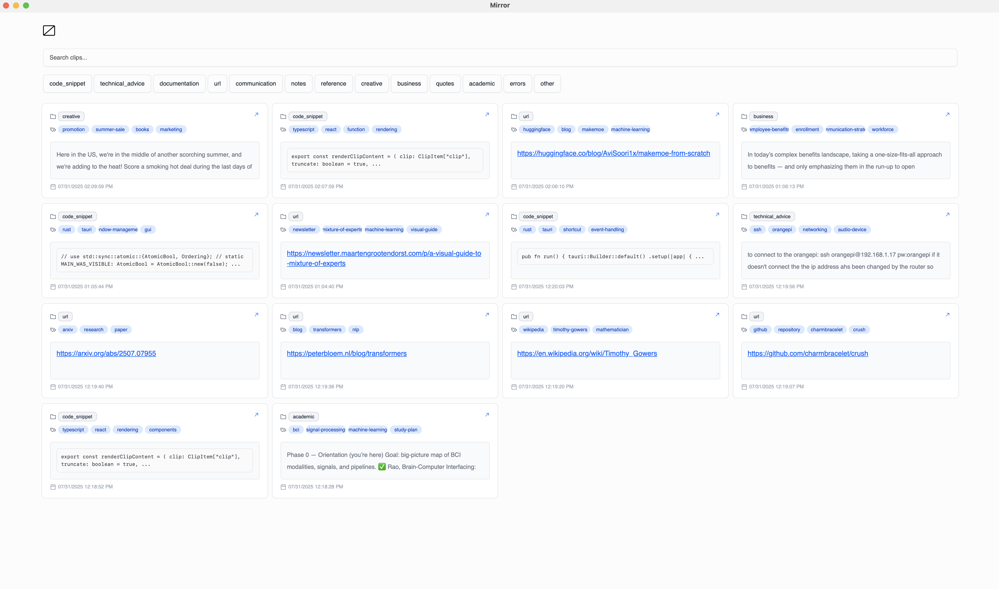

## Mirror



**Mirror currently only supports Mac**

**Mirror** is an AI-assisted knowledge management tool designed to save and automatically organize text, images, URLs and more.

Mirror quietly watches your clipboard, stores every item in a local SQLite database, and calls an LLM to **auto-categorise, summarise, and tag** each item.

| Feature                  | What it does                                                    |
| ------------------------ | --------------------------------------------------------------- |
| 🧠 **Auto-AI**           | Auto categorizes and tags saved items using an LLM              |
| 🔍 **Instant search**    | Fuzzy-search by plain text **or** tags;                         |
| ⌨️ **Global hotkeys**    | `Ctrl+Shift+S` saves the clip                                   |
| 🌗 **Tauri desktop app** | Native tray icon, zero Electron weight, small memory footprint. |

## Quick start

> **Prerequisites**
>
> - Node 18 + npm
> - Rust toolchain (stable)
> - Tauri CLI: `cargo install tauri-cli --locked`
> - (optional) `OPENAI_API_KEY` if you want AI tagging

```bash
git clone https://github.com/evisdrenova/mirror.git
cd mirror

# 1. install JS deps & Tauri binaries (~3-5 min)
npm install            # uses Vite + Radix UI stack

# 2. run in dev mode (hot-reload Rust + React)
npm run tauri dev
```

First launch creates `~/.mirror/mirror.db` and starts listening to your clipboard.

---

## Configuration

| File   | What to change   |
| ------ | ---------------- |
| `.env` | `OPENAI_API_KEY` |

---

## Roadmap

- [ ] **image support**
- [ ] **dynamic category creation**
- [ ] **sync with other backends like obsidian**
- [ ] **dark mode**
- [ ] **better responsiveness**

Contributions & bug reports are welcome—open an Issue or drop a PR!
